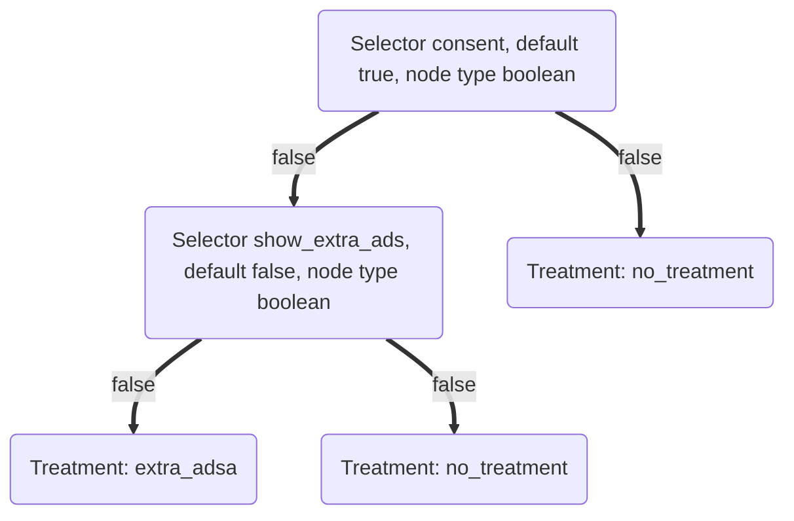

```mermaid 
graph TB 
4("Selector consent, default true, node type boolean")
4=="false"==>2 
4=="false"==>3 
2("Selector show_extra_ads, default false, node type boolean") 
2=="false"==>0 
2=="false"==>1 
0("Treatment: extra_adsa") 
1("Treatment: no_treatment") 
3("Treatment: no_treatment") 
```